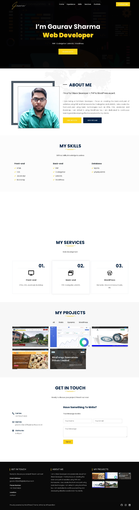

  

<h1 align="center">
  Gaurav Sharma
</h1>

<h3 align="center">
  Web Developer
</h3>

  

### WordPress Portfolio Website (Single Page)
This is my Personal Portfolio Website built using WordPress and the Arrival Me template. It highlights my professional background, skills, portfolio projects, and contact details.

 

### Technology Stack
- WordPress
- Arrival Me Theme (https://wpoperation.com/themes/arrival-me/)
- Elementor Pro, WPForms etc. plugins
- MySQL Database

 

### Features
- Responsive design – mobile, tablet, and desktop friendly
- Homepage with profile, skills, and project gallery
- Contact section with integrated form
- SEO optimized and lightweight
- Easy to customize via WordPress dashboard

 

### Setup Instructions 
1. setup wordpress and its database
2. import/install plugin, all-in-one wpmigration unlimited extention
3. import the project (.wpress) file through all-in-one wpmigration

 

### Credintials
userename: admin  
password: gaurav110601  

 

### Sample Snapshots

Website:

 

### Developer

Gaurav Sharma  
gaurav110601@gmail.com  
> [LinkedIn](https://www.linkedin.com/in/gaurav110601/)
<!-- ................................................................................................................................. -->
